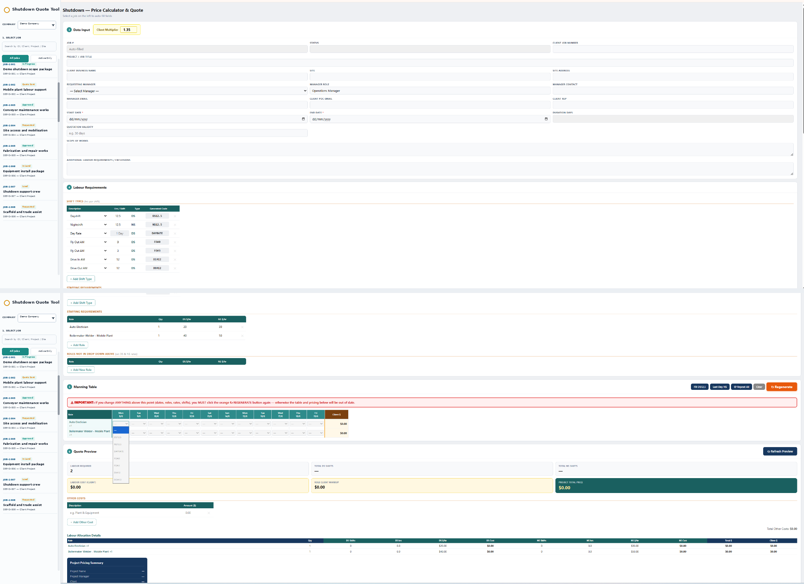
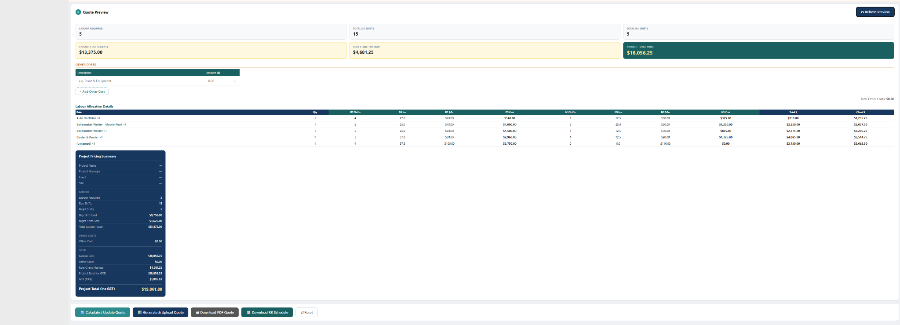
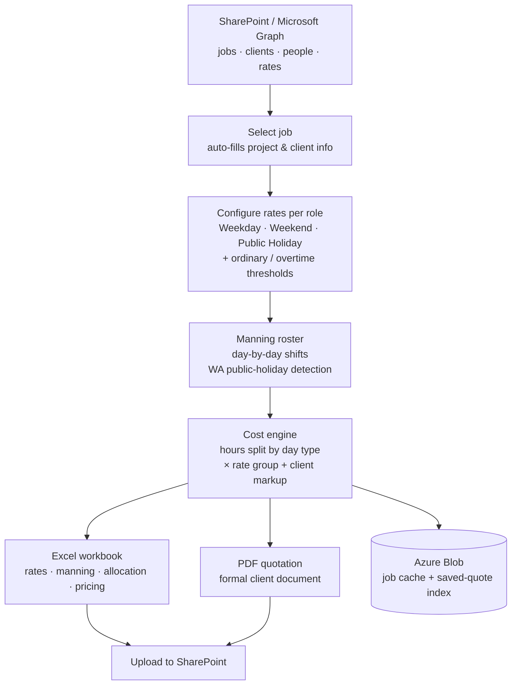

# Labour Hire — Online Quote & Pricing Tool

A Flask web app that builds labour-hire quotes end to end: pulls live job &
client data from **SharePoint (Microsoft Graph)**, configures tiered shift
rates, builds a day-by-day manning roster, then generates a polished **Excel**
workbook and a formal **PDF** quotation — uploaded straight back to SharePoint.
Built for mining, civil and industrial labour hire; deployed on **Azure App
Service**.

> **Note:** This is a desensitised public copy. Company names, brands
> (e.g. "Acme Group", "Northwind Workforce"), tenant details and credentials are
> illustrative placeholders. Real values are supplied via environment variables
> (see [`.env.example`](.env.example)) and are never committed.

---

## Screenshots

> Add your desensitised screenshots to `docs/screenshots/` with the filenames
> below and they will render here.

### Rate configuration & live cost calculation


### Manning roster & pricing summary


---

## Architecture



---

## Features

- **Live SharePoint integration** — jobs, clients, people and rates via
  Microsoft Graph (client-credentials auth); selecting a job auto-fills the
  whole form.
- **Tiered rate model** — separate weekday / weekend / public-holiday rates,
  with ordinary + overtime (ORD) thresholds per role.
- **Automatic WA public-holiday detection** — holiday dates drive which rate
  group applies, no manual flagging.
- **Manning roster** — day-by-day shift grid with one-click *Repeat week /
  weekday / weekend / public-holiday* pattern fill and PH highlighting.
- **Live cost engine** — hours split by day type × matching rate group, plus
  client markup, with a real-time pricing summary.
- **Excel generator** (openpyxl) — project info, rate card, manning table,
  grouped cost-allocation breakdown and pricing summary.
- **PDF generator** (reportlab) — a formal, client-ready quotation document.
- **Multi-brand output** — Excel/PDF banner, colours and logo switch per brand.
- **Azure Blob storage** with transparent local-file fallback for dev, and
  gzipped responses for fast page loads.

---

## Tech Stack

| Layer       | Technology                          |
|-------------|-------------------------------------|
| Backend     | Python, Flask                       |
| Data source | SharePoint via Microsoft Graph API  |
| Storage     | Azure Blob Storage (local-file fallback) |
| Excel       | openpyxl                            |
| PDF         | reportlab                           |
| Hosting     | Azure App Service (gunicorn)        |

---

## Setup

### 1. Clone the repo

```bash
git clone https://github.com/Pearlluo/shutdown-quote-tool.git
cd shutdown-quote-tool
```

### 2. Install dependencies

```bash
pip install -r requirements.txt
```

### 3. Configure `.env`

Copy [`.env.example`](.env.example) to `.env` and fill in your values:

```ini
# Microsoft Graph (SharePoint)
SHAREPOINT_TENANT_ID=your-tenant-guid
SHAREPOINT_CLIENT_ID=your-app-client-id
SHAREPOINT_CLIENT_SECRET=your-app-client-secret
SHAREPOINT_HOST=your-tenant.sharepoint.com
SITE_NAME=BMS
SITE_NAME1=IMS

# Azure Blob Storage
BLOB_CONNECTION_STRING=your-azure-connection-string
CONTAINER=your-container-name
```

### 4. Run

```bash
python app.py --serve
```

Visit `http://localhost:5000`. Run `python app.py` (without `--serve`) to
refresh the job cache from SharePoint.

---

## Usage

1. **Pick a job** — project, client, site and dates auto-fill from SharePoint.
2. **Set rates per role** — weekday, weekend and public-holiday `$/hr`.
3. **Build the manning roster** — fill shifts day by day, or use *Repeat*
   buttons to copy a week forward.
4. **Review the live pricing summary** — cost split by weekday / weekend / PH,
   markup and project total.
5. **Generate & Upload Quote** (Excel → SharePoint) or **Download PDF Quote**.

---

## Project Structure

```
shutdown-quote-tool/
├── app.py                 # Flask routes, page rendering, orchestration
├── graph_client.py        # Microsoft Graph auth + REST helpers
├── operations_folders.py  # Locate/traverse SharePoint quote folders
├── storage.py             # Azure Blob storage (local-file fallback) for JSON data
├── blob_index.py          # Saved-quote index in Blob
├── brands.py              # Brand / theme definitions (colours, logos, titles)
├── excel_generator.py     # Excel workbook generation (openpyxl)
├── pdf_generator.py       # PDF quotation generation (reportlab)
├── wa_holidays.py         # WA public-holiday dates
├── seed_blob.py           # Seed Blob with initial data
├── upload_brand.py        # Upload brand logos to Blob
├── templates/html3.html   # Single-page front end (UI + client-side logic)
├── requirements.txt
├── startup.txt            # Azure App Service startup command (gunicorn)
└── DEPLOY.md              # Azure deployment notes
```

---

## Deployment

Deployed on **Azure App Service** (Linux, Python) with gunicorn:

```
gunicorn --bind=0.0.0.0:8000 --timeout 600 --workers 2 app:app
```

Secrets are set as App Service **Application settings**, not committed. See
[`DEPLOY.md`](DEPLOY.md) for the full deployment guide.
